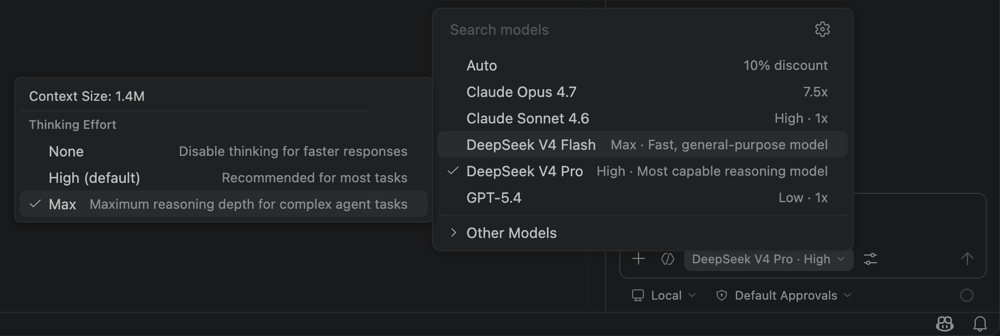
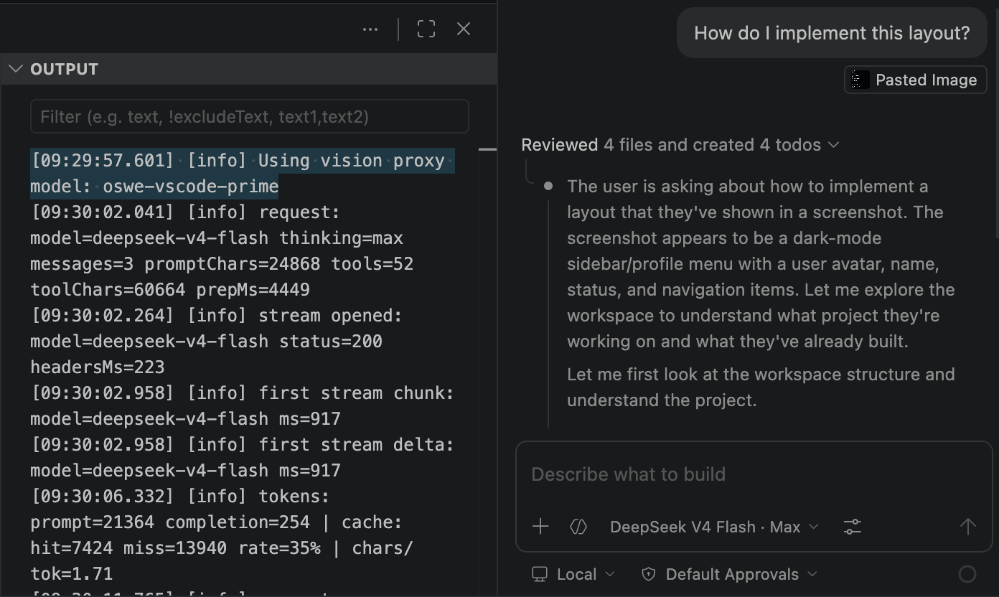
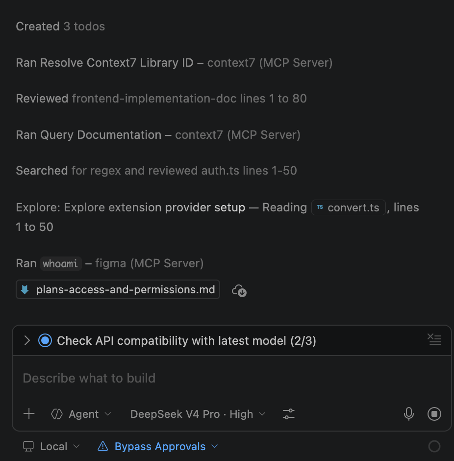

# Muse Spark 1.1 for Copilot Chat

<p align="center">
  <!-- marketplace-readme:remove-start -->
  <a href="https://marketplace.visualstudio.com/items?itemName=LukeSpine.meta-spark-for-copilot"></a>
  <a href="https://open-vsx.org/extension/LukeSpine/meta-spark-for-copilot"></a>
  <br/>
  <!-- marketplace-readme:remove-end -->
  
</p>

<p align="center">
  <a href="https://github.com/spinespine/meta-spark-for-copilot/blob/main/README.md">English</a> |
  简体中文
</p>

**在 Copilot Chat 模型选择器中直接使用 Muse Spark 1.1——原生视觉、推理强度控制与 Agent 工具。**

<p align="center">
  
</p>

## 为什么选这个扩展？

- **不是替换 Copilot，而是增强它。** 没有新的侧边栏，没有新的聊天界面。只是在你已经在用的模型选择器中多了一个选项。
- **Agent 模式、工具调用、Instructions、MCP、Skills——全部正常运作。** Copilot 的完整能力栈，现在跑在 Meta Spark 上。
- **原生视觉。** 把截图、图表、照片拖进聊天，Muse Spark 可直接理解（单次最多 50 张图，无需代理）。
- **需自行提供 API Key，直接向 Meta 付费。** 你的 API Key（`LLM...`），你的账单，你的速率限制。密钥通过 SecretStorage 存入系统密钥链。

## 功能特性

### Muse Spark 1.1 出现在模型选择器中
单一模型 `muse-spark-1.1`，支持 1,048,576 上下文、131,072 最大输出，多模态输入（文本/图片/视频/PDF），文本输出。可在对话中途切换模型，不丢失聊天历史。

### 原生视觉
将图片拖入聊天后，会以 base64 data URL 形式作为 `image_url` 内容发送。无需代理，无需额外配置。

<p align="center">
  
</p>

### 推理强度控制
完整支持 `reasoning_effort`：`minimal`（最快）、`low`、`medium`（均衡，默认）、`high`（深度）、`xhigh`（最大）。通过 Copilot Chat 模型选择器菜单设置。注意：Meta API 不支持 `none`，会映射为 `minimal`。

### 继承全部 Copilot 能力
Agent 模式、工具调用（文件编辑、终端等）、自定义 Instructions、MCP、Skills——因为本扩展实现了 `vscode.LanguageModelChatProvider`。

<p align="center">
  
</p>

## 快速开始

### 前置条件

- VS Code 1.116 及以上版本
- GitHub Copilot 订阅（Free / Pro / Enterprise）
- Meta API Key，从 [dev.meta.ai](https://dev.meta.ai/) 获取，格式为 `LLM|...`

### 安装方式

1. **Microsoft VS Code** — 从 [VS Code Marketplace](https://marketplace.visualstudio.com/items?itemName=LukeSpine.meta-spark-for-copilot) 安装
2. **使用 Open VSX 的编辑器** — 从 [Open VSX](https://open-vsx.org/extension/LukeSpine/meta-spark-for-copilot) 安装

### 使用步骤

1. 命令面板（`Cmd/Ctrl+Shift+P`）运行 **Meta Spark: 设置 API Key**
2. 粘贴你的 Meta API Key（`LLM...`）
3. 打开 Copilot Chat，选择 **Muse Spark 1.1**

## 设置项

| 设置项 | 默认值 | 说明 |
|---|---|---|
| `meta-spark-copilot.baseUrl` | `https://api.meta.ai/v1` | Meta API 端点 |
| `meta-spark-copilot.maxCompletionTokens` | `0` | 最大输出 Token 数（`0` = API 默认） |
| `meta-spark-copilot.modelIdOverrides` | 官方 ID | 兼容第三方 API 时覆盖模型 ID |
| `meta-spark-copilot.debugMode` | `minimal` | 诊断模式：`minimal` / `metadata` / `verbose` |
| `meta-spark-copilot.experimental.stabilizeToolList` | `false` | 实验性：稳定工具列表以提升缓存命中率 |

## 定价

输入 $1.25 / 1M，缓存输入 $0.15 / 1M，输出 $4.25 / 1M。无长上下文溢价。详见 [Meta 定价](https://dev.meta.ai/docs/getting-started/pricing-rate-limits)。

## 速率限制

免费：60 RPM / 2M TPM。付费：3000 RPM / 4M TPM（按团队）。429 响应包含 `Retry-After`。

## 错误处理

- `401 invalid_api_key`：检查 `LLM...` 格式
- `429 rate_limit_exceeded`：等待 `Retry-After`
- `400 content_policy_violation`：内容策略
- `503 server_shutting_down`：可重试
- `504 gateway_timeout`：优先使用流式请求

## 开发

```bash
npm install
npm run compile
# 然后按 F5 启动 Extension Host
```

## 许可证

[MIT](LICENSE)
